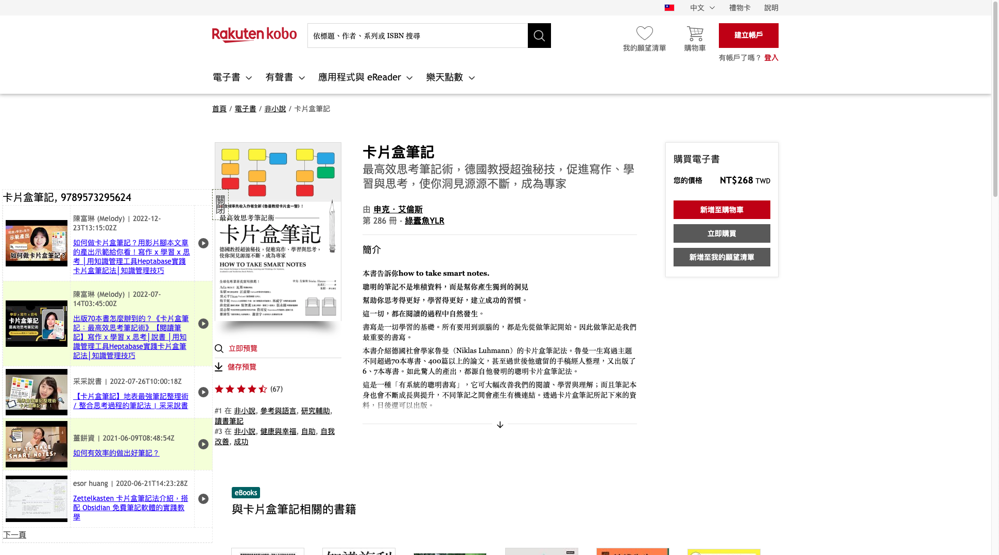

# Chrome extension 瀏覽書籍，顯示 Youtube 上相關的說書影片

## 介紹

在瀏覽博客來,kobo時，會去 youtube 上搜尋該書籍的相關影片，可以直接點選瀏覽。
這個 extension 初始是嘗試使用詢問 ChatGPT 的結果，組合出來的。

博客來

kobo

## 安裝

下載到您的資料夾後，進入 chrome://extensions/ ，打開開發人員模式，點選載入未封裝項目，選擇資料夾即可。
還需要自行申請 Youtube API key。詳情申請方式請參考 [Youtube API](https://developers.google.com/youtube/v3/getting-started?hl=zh-tw)。
申請完 Youtube API 後需到設定頁面填入您的 API Key。

## 版本歷程

- 1.0.1
  - 增加複製"書名,isbn"到剪貼簿
- 1.0.0
  - 初始版本

## Todo
- [x] youtube 設定 api key 頁面
- [x] 表格位置大小依據網頁位置調整
- [x] 搜尋結果分頁
- [x] 內嵌播放
- [x] 搜尋結果畫面調整
- [x] youtube 設定 api key 頁面調整
- [ ] 新增到標記書單
- [ ] 瀏覽標記書單
- [ ] 搜尋結果暫存，節省 api 次數
- [ ] 程式碼調整

## License

MIT
